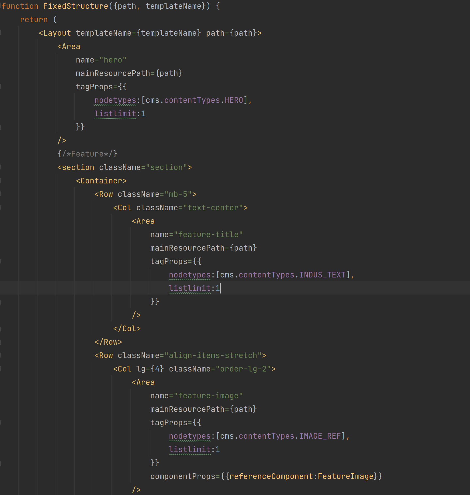

# headless-templatesSet

This module is one of the three components of the Jahia Nextjs initiative. The aim of this initiative is
to explore and explain the Jahia capabilities to easily create and manage headless web project.

|Developers|Web Contributors|
|---|---|
|a web project is easy to create and maintain when they have an SDK in their preferred languages, and they can create, update, test and deploy component quickly.|a web project is easy to maintain when they understand the web site page structure and when they can create a content by clicking a button or just copy past a WYSIWYG content.|
| ![100] | ![101] |

For developers point of view a web project is easy to create and maintain when they have an SDK in their
preferred languages, and they can create, update, test and deploy component quickly.

For a web contributors, a web project is easy to maintain when they understand the web site page structure and
when they can create a content by clicking a button or just copy past a WYSIWYG content.
| | ![101] |

[100]: doc/images/100_DevPageTemplate.png
[101]: doc/images/101_ContribPageTempalte.png
